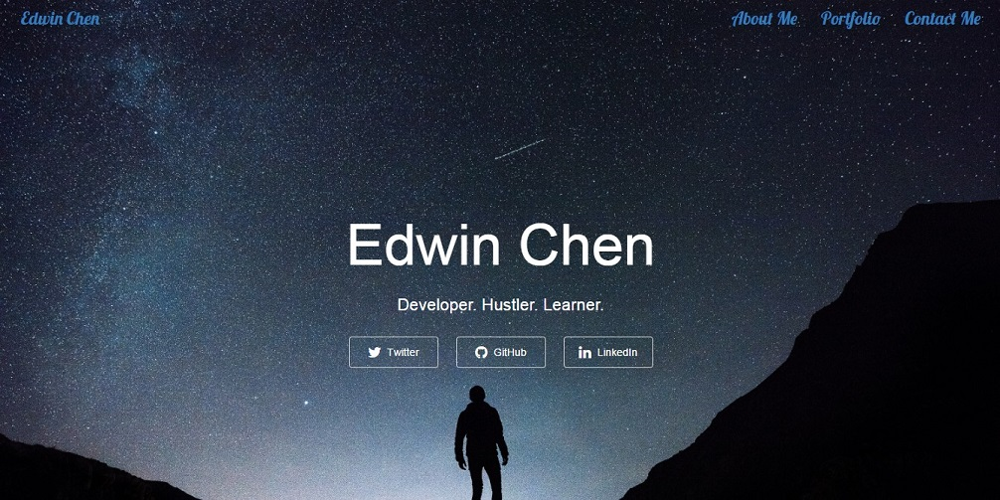

## Free Code Camp - Build A Personal Portfolio Webpage

This is one of the Free Code Camp Basic Front End Development Projects. In this project, I build a personal portfolio webpage using Bootstrap 3, CSS and JavaScript.

[View demo site here.](https://webdevtuts.github.io/freecodecamp_personal_portfolio/)

